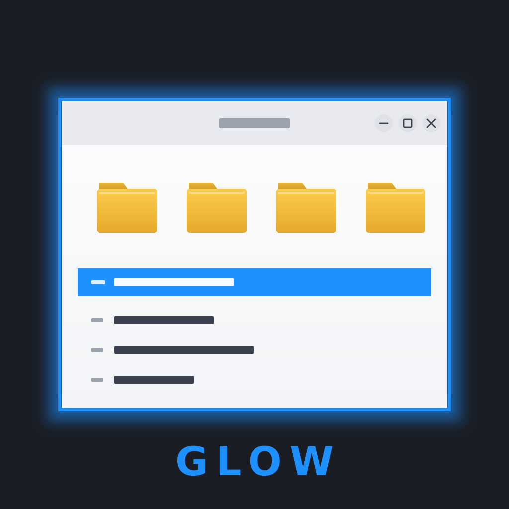
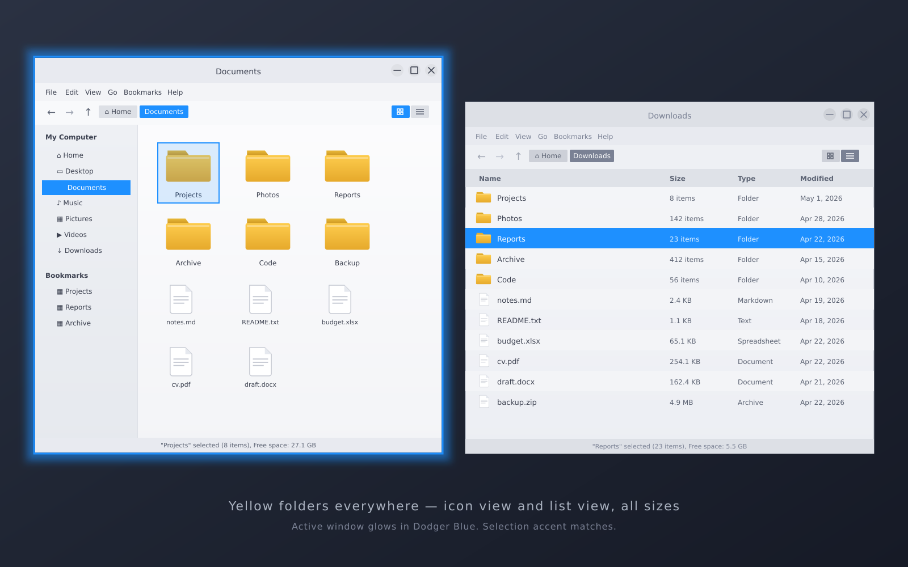
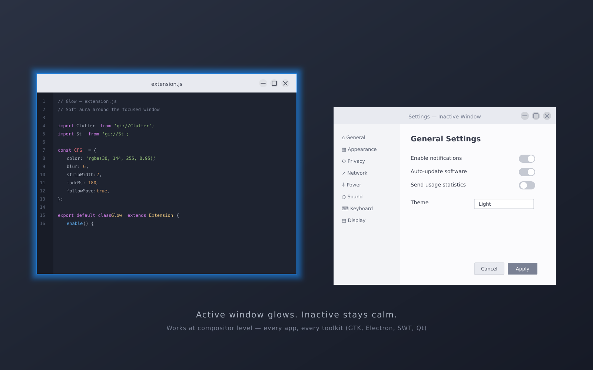
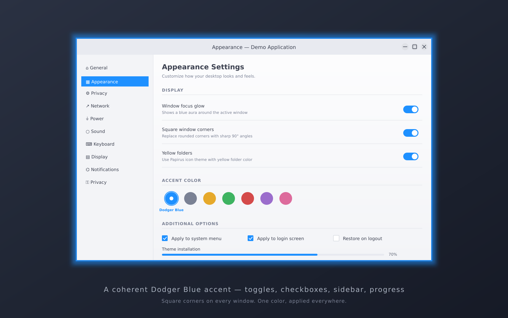

<p align="center">
  
</p>

<h1 align="center">Glow</h1>

<p align="center">
  A soft Dodger Blue aura around the focused window — plus a coherent set of
  desktop tweaks: blue accents everywhere, square window corners, and
  Windows-style yellow folders.
  <br><br>
  <a href="gnome/">GNOME / Zorin version</a> ·
  <a href="kde/">KDE Plasma 6 version</a> ·
  <a href="https://www.opendesktop.org/p/2357822/">OpenDesktop page</a>
  <br><br>
  
  
  
</p>

---

## What it looks like

| | |
|---|---|
|  |  |



## The idea

One visual identity, applied consistently across the whole desktop:

- **Focus glow** — a thin Dodger Blue (`#1e90ff`) aura around the currently
  focused window. Works with *every* app (GTK, Electron, Qt, SWT) because it
  operates at the compositor level.
- **Dodger Blue accent everywhere** — selections, toggles, breadcrumbs,
  switches, progress bars.
- **Square window corners** — no rounded corners.
- **Yellow folders** — Windows-style yellow folders via Papirus, yellow even
  at small sizes in list view (where Papirus normally falls back to
  monochrome symbolic icons).
- **Compact file manager zoom** — content font size matching the sidebar.

Everything is **modular** (install only what you like), **idempotent**
(safe to re-run) and **fully reversible** (`--remove` puts you back exactly
where you started).

## Quick start

### GNOME (Zorin OS 18, Ubuntu 24.04+, any GNOME 45–52 desktop)

```bash
git clone https://github.com/GITHUB_USER/glow.git
cd glow/gnome
bash install.sh
```

Then log out and back in. See [gnome/README.md](gnome/README.md) for
per-module usage, customization and full uninstall.

### KDE Plasma 6

```bash
git clone https://github.com/GITHUB_USER/glow.git
cd glow/kde
bash install.sh
```

See [kde/README.md](kde/README.md). Note: on KDE the focus glow maps to a
colored active titlebar/border (KWin has no compositor extension system like
GNOME Shell).

## Module map

| Effect | GNOME module | KDE module |
|---|---|---|
| Focus glow | `focus-glow` (Shell extension) | `focus-border` |
| Blue accent | `theme-tweaks` (GTK CSS) | `accent` |
| Square corners | `theme-tweaks` | `square-corners` |
| Yellow folders | `yellow-folders` | `yellow-folders` |
| File manager icon + zoom | `nemo-icon`, `nemo-zoom` | `dolphin` |
| Super → Overview | *(native)* | `overview` |

## Requirements

- **GNOME**: GNOME Shell 45–52, apt-based distro (tested on Zorin OS 18/18.1,
  GNOME 46, X11 and Wayland). On Ubuntu the Nemo modules skip automatically
  if Nemo is not installed.
- **KDE**: Plasma 6 (kwriteconfig6), Plasma 5 fallback included.
- `sudo` and an internet connection (apt + papirus-folders).

## License

[GPL-3.0-or-later](LICENSE) © Vincenzo Caselli
